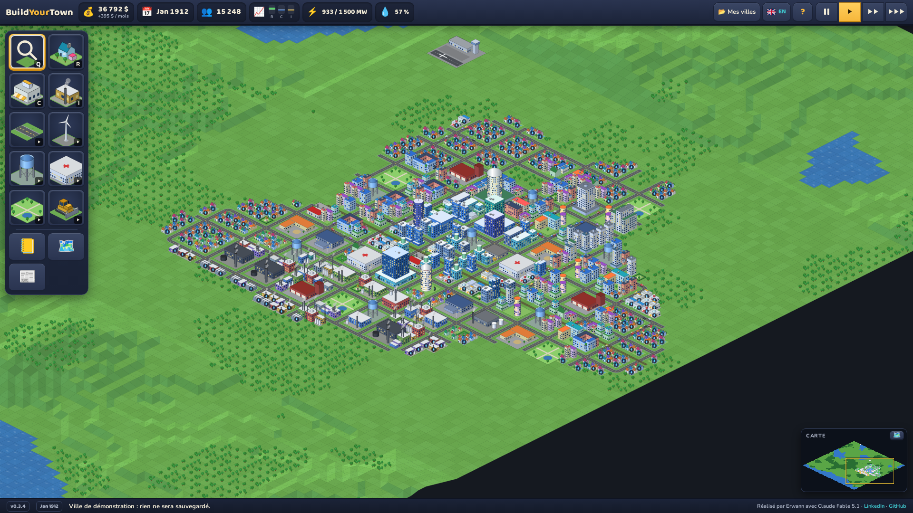
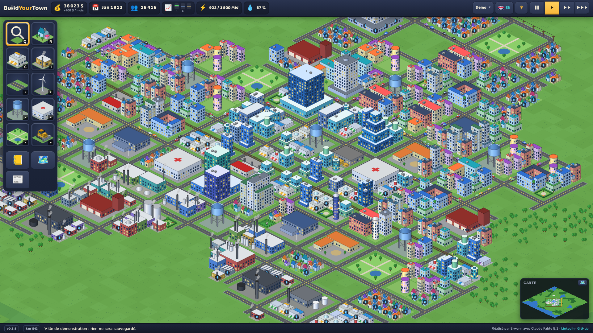
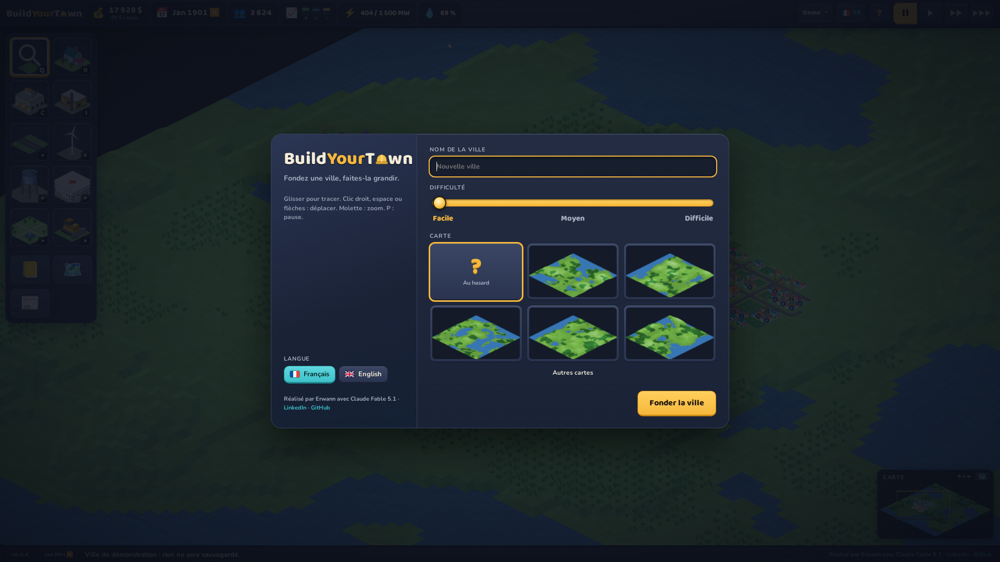
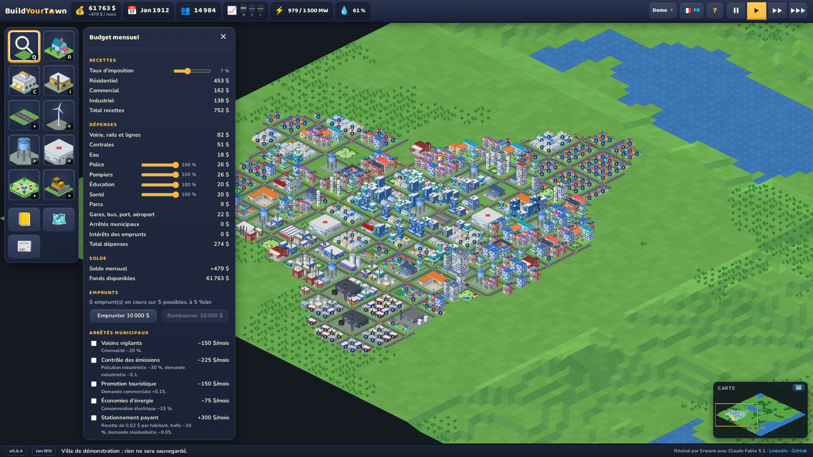
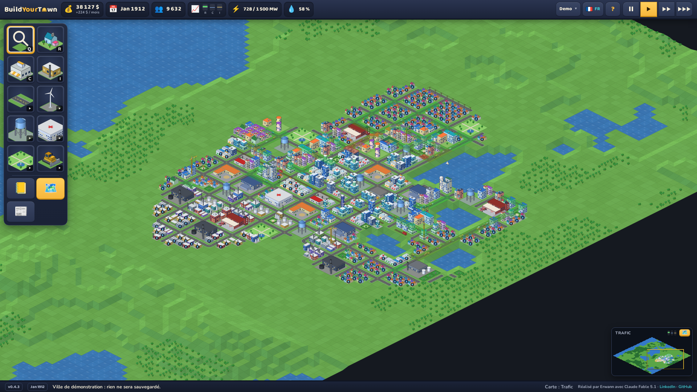

# BuildYourTown

**Un city-builder isométrique qui tourne entièrement dans le navigateur.**
Fondez une ville, tracez routes et rails, zonez, alimentez en électricité et
en eau, gérez budget, services, trafic, catastrophes, et regardez-la grandir.
Français et anglais. Aucune installation, aucun compte, aucune donnée envoyée
à un serveur : la partie est sauvegardée dans votre navigateur.

*An isometric city-builder that runs entirely in the browser, in French and
English. No install, no account, saves stay in your browser. To play:
[buildyourtown.com](https://buildyourtown.com). To run it yourself, see
« Lancer chez soi » below.*

Version 0.3.0 · [Jouer en ligne](https://buildyourtown.com) · Réalisé par
Erwann avec Claude Fable 5.1



## En bref

- Carte isométrique de 128 × 128 cases avec eau, forêts et relief en
  terrasses ; terraformage à la main.
- Zones résidentielles, commerciales et industrielles qui se développent
  seules sur cinq niveaux de densité, et fusionnent en immeubles 2 × 2 puis
  3 × 3 quand le quartier s'y prête.
- Réseaux : routes, ponts, lignes haute tension, voie ferrée et gares,
  autoroutes, dépôts de bus, port, aéroport.
- Énergie (éolien, charbon, gaz, nucléaire), eau, police, pompiers, écoles,
  hôpitaux, parcs, récompenses de maire dont l'arcologie.
- Simulation mensuelle : demande, valeur foncière, pollution, criminalité,
  trajets domicile-emploi et embouteillages, budget détaillé, emprunts,
  arrêtés municipaux, trois niveaux de difficulté.
- Catastrophes : incendies qui se propagent, inondations, tornades, séismes.
- Journal avec courbes, conseils et historique ; cartes de données
  (pollution, trafic, foncier, couverture des services…).

| | |
|---|---|
|  |  |
|  |  |

## Lancer chez soi

Il n'y a rien à installer sur la machine à part Docker. Le jeu est un site
statique servi par nginx.

```sh
git clone https://github.com/Rapsody09/buildyourtown.git
cd buildyourtown
docker build -t buildyourtown .
docker run --rm -p 8080:8080 buildyourtown
```

Puis ouvrir http://localhost:8080. L'image fait environ 20 Mo, tourne sans
privilèges (port 8080, utilisateur non root) et expose `/healthz` pour les
sondes. Elle porte la version en label OCI (`org.opencontainers.image.version`).

Avec `make` : `make prod-image` construit l'image, `make prod-run` la lance
sur http://localhost:8081.

## Jouer

Commencez par une centrale, quelques routes, puis des zones de part et
d'autre. Les zones ne se développent que si elles ont une route à moins de
trois cases, du courant, et des emplois ou des habitants à portée de trajet.

| Touche | Action |
|---|---|
| R / C / I | zones résidentielle, commerciale, industrielle |
| T | route (glisser, tracé en L ; sur l'eau, devient un pont) |
| L | ligne haute tension |
| N | niveler le terrain (glisser un rectangle) |
| B | bulldozer |
| Q | informations sur une case |
| P, 1, 2, 3 | pause, vitesses |
| Échap | aucun outil, fermer les panneaux |

Clic droit, molette-clic, espace + glisser ou flèches : déplacer la vue.
Molette : zoom. La barre de gauche donne accès à tous les outils, avec le
nom, le coût et la touche au survol. Le groupe Transport réunit routes, rails,
autoroutes et équipements ; Énergie, Eau et Services ouvrent la liste de leurs
bâtiments ; Parcs contient aussi les monuments à débloquer ; le groupe
Bulldozer réunit la démolition et les outils de relief. La loupe, en tête de
barre, est le mode par défaut : un clic renseigne sur une case.

**Sur mobile ou tablette**, la barre d'outils passe en bas de l'écran et les
panneaux s'ouvrent en volets. Un doigt déplace la vue ; deux doigts zooment.
Un appui long pose un bâtiment, qui suit le doigt jusqu'au relâchement, ou
trace une route, une zone ou une ligne en glissant. Un appui bref renseigne
sur une case avec la loupe, ou montre l'aperçu d'un bâtiment qu'un second appui
confirme. La mini-carte en bas à droite montre où l'on se trouve : appuyer
dessus déplace la vue.

### Ce qui fait vivre la ville

- **Électricité** : le courant se propage de proche en proche entre zones,
  bâtiments et lignes, et traverse une route d'une case. Si la consommation
  dépasse la capacité, les quartiers les plus éloignés des centrales sont
  coupés.
- **Eau** : pompes au bord de l'eau et châteaux d'eau alimentent un rayon.
  Sans eau, une zone plafonne en faible densité.
- **Valeur foncière** : montée par l'eau, les forêts, les parcs et les
  services, plombée par la pollution, la criminalité et les bouchons. Elle
  plafonne la densité et module les recettes.
- **Trajets** : chaque mois, les habitants rejoignent les emplois les plus
  proches par le réseau ; les navetteurs se cumulent sur chaque case de route.
  Au-delà de la capacité, la case sature, coûte plus cher à traverser et
  pollue. Gares, bus et autoroutes soulagent les axes.
- **Budget** : impôts par type de zone, dépenses par poste, financement de
  chaque service, emprunts. La difficulté module la demande, les coûts, la
  fréquence des catastrophes et le taux des emprunts.
- **Catastrophes** : déclenchables depuis le menu ou aléatoires. Ce qui brûle
  ou s'écroule laisse des décombres à déblayer ; une zone privée de courant
  ou d'accès se vide lentement, le temps de réparer.

### Langues

Français ou anglais : détection du navigateur au premier lancement, bouton
dans le bandeau, choix sur l'écran d'accueil. `?lang=fr` ou `?lang=en` dans
l'adresse force la langue.

## Développement

Tout l'outillage tourne dans un conteneur, rien n'est installé sur la machine.

```sh
make image      # construit l'image de dev (node + vite)
make dev        # serveur de dev avec rechargement à chaud : http://localhost:5173
make build      # typecheck + build de production dans dist/
make typecheck
make simtest ARGS="30 12345 7 mixed moyen"   # simulation headless : années, graine, impôts, scénario, difficulté
make screenshots # régénère les captures de ce README depuis l'image de production
```

Adresses utiles en dev : `http://localhost:5173/?demo=10` ouvre une ville de
démonstration simulée sur dix ans ; options `&showcase`, `&zoom=1`,
`&map=traffic`, `&panel=budget`, `&panel=journal`, `&disaster=fire`,
`&welcome`.

Pile : TypeScript, Vite, canvas 2D, aucune dépendance à l'exécution. Les
sprites sont dessinés à la volée (formes isométriques, palettes variées,
quatre silhouettes par bâtiment), donc aucun fichier image dans le jeu.

```
src/game/    état de la ville, terrain, simulation, outils, bâtiments
src/render/  sprites procéduraux, icônes, rendu isométrique
src/ui/      souris / clavier, interface, écran d'accueil, aperçus de cartes
src/i18n.ts  dictionnaire français / anglais
scripts/     simtest.ts, test d'équilibrage headless
nginx/       configuration de l'image de production
```

La version vit dans `package.json` : elle s'affiche en bas du jeu et est
posée sur l'image Docker. `scripts/release.sh patch|minor|major` publie une
version : bump, README, notes de version (`CHANGELOG.md`), commit et tag,
image et déploiement.

## Crédits

Réalisé par Erwann avec Claude Fable 5.1.
[LinkedIn](https://www.linkedin.com/in/erwann-maignan/) ·
[buildyourtown.com](https://buildyourtown.com)
